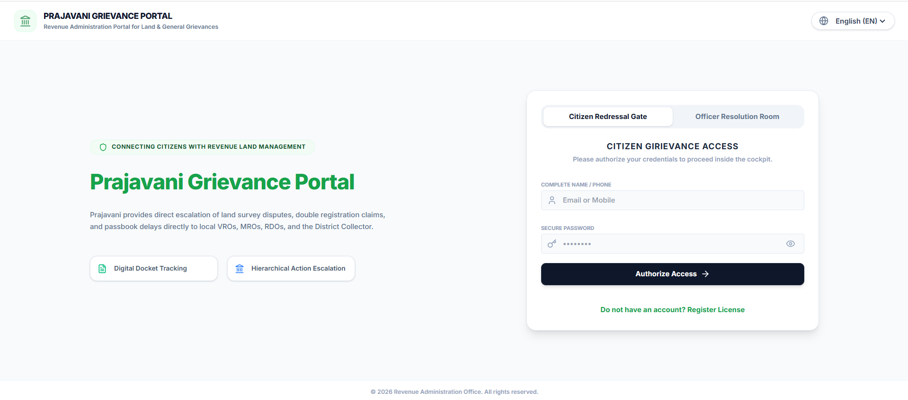

# 🚀 Prajavani – Online Complaint Management System

A full-stack **MERN** web application that digitizes the complaint registration and grievance resolution process. The system enables citizens to submit and track complaints while allowing government officers to efficiently manage, assign, and resolve grievances through a secure role-based platform.

## 📸 Login Page



---

## 📌 Features

* 🔐 Secure Citizen & Officer Authentication
* 📝 Online Complaint Registration
* 📊 Real-Time Complaint Status Tracking
* 👨‍💼 Officer Dashboard for Complaint Management
* 🔄 Complaint Assignment & Status Updates
* 🔔 Real-Time Notifications
* 📱 Responsive User Interface
* 🛡️ Role-Based Access Control

---

## 🛠️ Tech Stack

| Category       | Technologies               |
| -------------- | -------------------------- |
| Frontend       | React.js, Bootstrap, Axios |
| Backend        | Node.js, Express.js        |
| Database       | MongoDB,SQL                   |
| Authentication | Token-Based Authentication |
| Tools          | Git, GitHub, VS Code       |

---

## 📂 Project Structure

```text
Prajavani-Grievance-Portal/
├── client/
│   ├── src/
│   └── public/
├── server/
│   ├── src/
│   └── db/
├── README.md
```

---

## ⚙️ Installation

```bash
git clone https://github.com/racharlajayasree06-ai/Online-Complaint-Management-System.git

cd Online-Complaint-Management-System

npm install

npm run dev
```

---

## 🌐 Live Demo

https://prajavani-grievance-portal869.ai.studio/

---

## 🎯 Future Enhancements

* Mobile Application
* AI-Based Complaint Classification
* GIS Location Tracking
* SMS & Email Notifications
* Analytics Dashboard
* Cloud Deployment


---

## ⭐ Support

If you found this project useful, consider giving it a ⭐ on GitHub.
